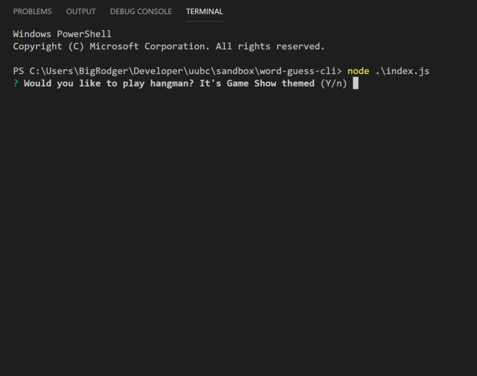

# word-guess-cli

## Overview

This is a console hangman game built with node.js. It was created as a study of constructor functons and modularization. It uses Inquirer to prompt users to guess the letters in a word that are first displayed in dashes as placeholders. 

