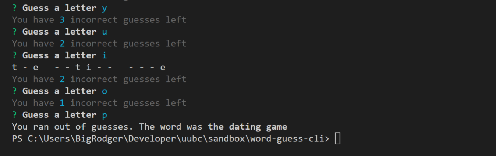
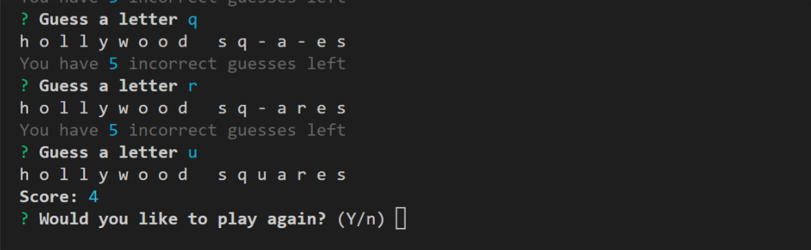
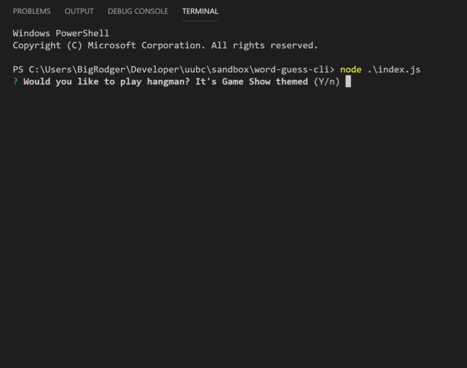

# word-guess-cli

## Overview

This 'word-guess-cli' is a hangman game built with node.js and played in the console. It was created as a study of constructor functons and modularization. Inquirer is used to prompt users to guess the letters of a Game Show name that is randomly selected from an array. Each missed guess is stored and counted against you. Correctly guessed words add to your overall score. A video demo can be viewed below. 

## Video Demo

## Built With:
* node.js
* inquirer
* chalk